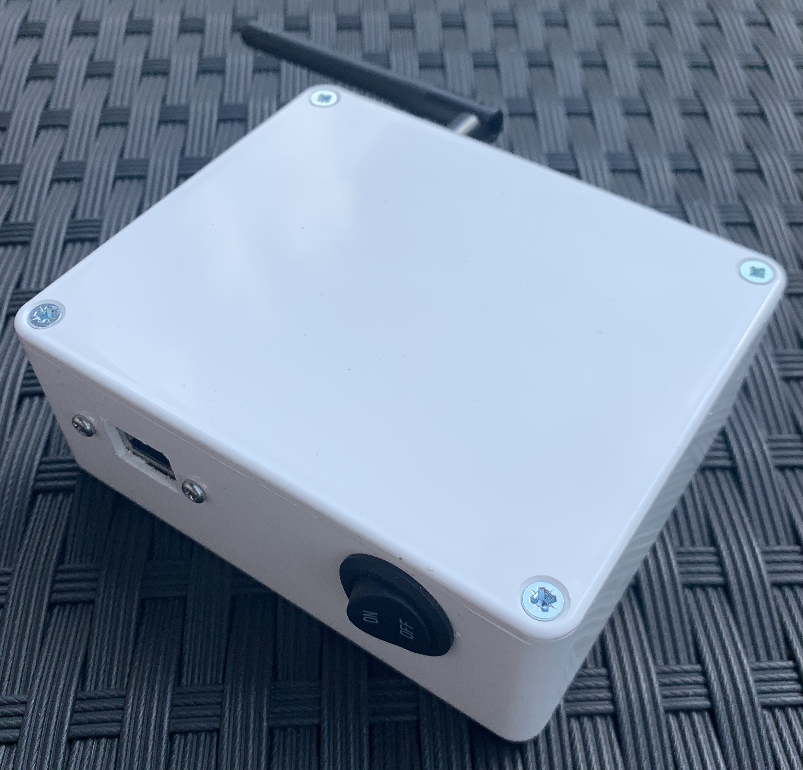
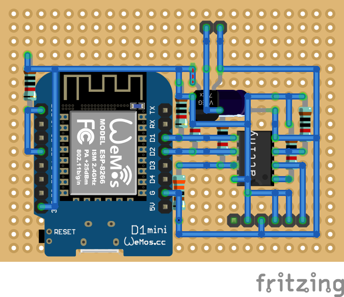
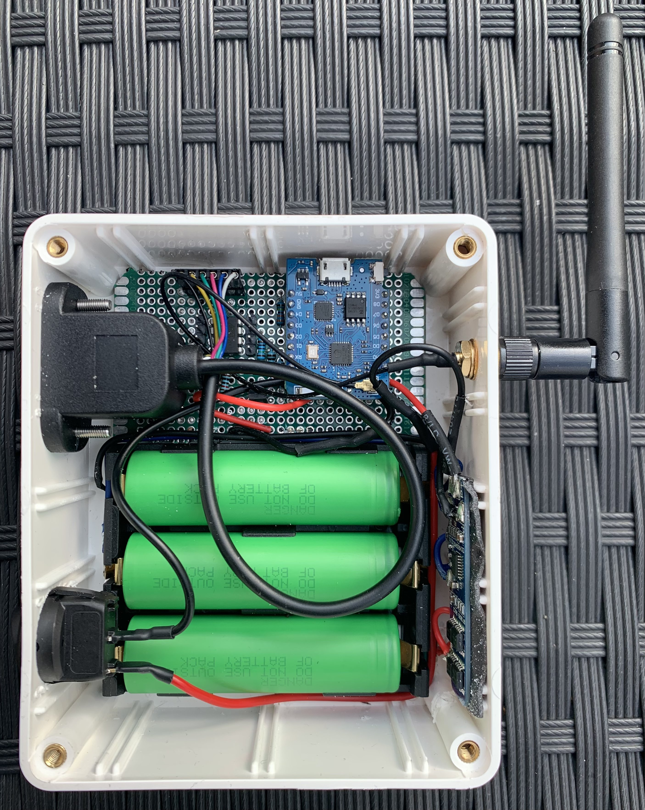
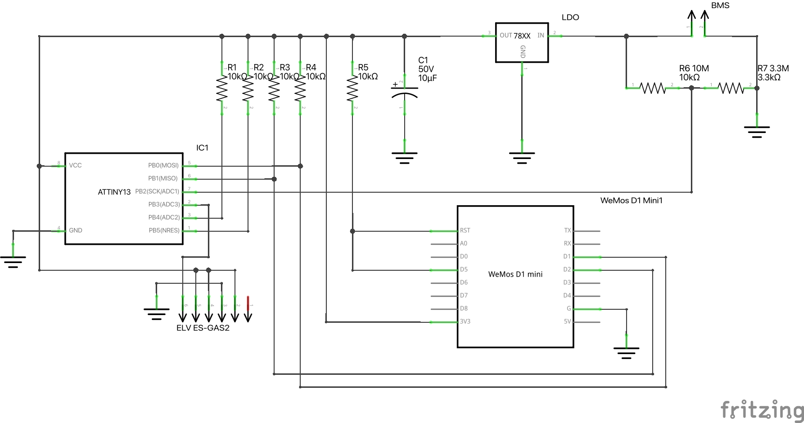

# I2C-Gas-Meter

I2C-Gas-Meter enables you to monitor your domestic gas consumption; a small attiny captures 
data from the gas meter which is then read by ESPHome. This project builds on the [ESPmeter
project from francescovannini](https://github.com/francescovannini/espmeter)

## Operating principle

For this device to work, we need a type of mechanical gas meter having a magnet 
installed on one of the digits of its counter. A probe equipped with a reed switch
is placed near or on top of the counter; the digit revolves when 
the gas flows and so does the magnet which becomes periodicaly detectable by 
the sensor. Keeping track of revolutions over time allows to calculate the 
amount of gas consumed during a certain period. 
While this project has been designed with gas meters in mind, it could 
theoretically work with other meters, such as water meters, as long as they 
have a detectable magnet moving along one of the indicators.



## Design

The device has been designed to be extremely easy to build, using a small number
of very common components. Particular attention has been put into energy
efficiency, trying to reduce consumption to the minimum to allow battery 
operation for (theoretically) more than a year. 

The ESP8266 power absorption is too high to be used to directly sample pulses
generated by the Hall effect sensor. Even using a Reed switch to wake-up the 
ESP at every pulse, consumption would be in the order of 15mA for the whole
ESP boot time + software sampling routine to run, assuming Wi-Fi being 
turned off from the start. This is too much to achieve battery life in the order
of years.

Instead, the ESP is coupled with an Tiny13, which takes care of the pulse 
recording part. The Tiny13 has a very low power consumption and can stay
asleep for most of the time. The ESP would then communicate with the Tiny13 
at regular intervals and then once per day would transmit data via Wi-Fi.




## Sampling frequency

In my particular configuration, the digit carrying the magnet completes a 
revolution in over a minute.

During this interval, the magnet is detectable by the sensor for about 1.5
seconds while being close enough to the sensor. 

Therefore setting the Tiny13 watchdog at 1Hz would ensure that the device is
woken up often enough so that it has time to power up the Hall sensor and detect
the presence of the magnet.

However, the larger the maximum gas flow that can be consumed, the faster the 
counter would spin, reducing the time the magnet is detectable by the sensor;
therefore depending on your meter model and your peak flow you may want to 
adjust this parameter in the code.

## Hardware



### Parts

* ATTiny13-20PU
* ESP8266 (D1 mini)
* H7333-A LDO regulator
* ELV ES-GAS2
* 10kΩ resistors (5x)
* 10MΩ resistor (see below)
* 3.3MΩ resistor (see below)
* 10μF 10V capacitor
* perfboard
* rj11 adapter 
* 6 pin header (optional)
* 4 pin header (2x optional)
* 3 18650 battery holder
* 3S BMS
* plastic enclosure
* 3 lead wire

### The probe

In my build, the reed switch is a pre build model that would also work for homematic IP.
The main benefit is that this module comes with adapters that make it fit perfect into the gas meter.

## Software on Tiny13 side:

The original code is written in C and compiled via 
[avr-gcc](https://gcc.gnu.org/wiki/avr-gcc)
I adapted the project so that you can compile and upload the code via the arduino IDE

Most of time, the ATTiny is in sleep state. Internal timer is used to wake up
regularly check the reed switch output and check the current voltage of the batteries.
The Tiny stores 3 hours of pulse counting in its own memory. 

Communication with ESP is achieved via a simplified implementation of the I2C
protocol, derived from "AVR311: Using the TWI Module as I2C Slave" Atmel 
application note available [here](http://ww1.microchip.com/downloads/en/AppNotes/atmel-2565-using-the-twi-module-as-i2c-slave_applicationnote_avr311.pdf)

Battery pack voltage is fed through a voltage divider and compared with the 3.3V 
provided by the voltage regulator via the ADC. This is not very accurate but
it should be good enough to roughly estimate battery discharge rate. 

What it is sent to the ESP is contained in the following struct:

	typedef struct pulse_log_t {
		uint8_t checksum;
		uint8_t vcc;
		uint16_t ticks;
		uint8_t frames[LOG_FRAMES];
	} pulse_log_t;

* checksum is a simple modulo 256 of sum of the other bytes of the struct
* vcc is updated every 3 hours and it's the output of the ADC used to measure
battery voltage (see below)
* ticks is the number of seconds since last communication with the ESP
* frames is an array of 36 bytes, every byte is the number of pulses recorded in
the corresponding 5 minutes interval. 36 * 5m = 180m = 3h

### AVR fuses

For the I2C to work correctly, you would need to unset the CKDIV8 fuse bit 
when flashing the IC. 

```
Low:  0x6A
High: 0xFF
```

### Compensate for ADC (in-)accuracy

The Tiny13 ADC is used to monitor batteries voltage so the user can be alerted
when they need to be replaced. The Tiny13 ADC is a 10-bits ADC configured to
compare the Tiny13 VCC with pin PB2, which is fed the unregulated battery 
voltage through a voltage divider. The voltage divider is build to break the
12.6V max pack voltage into a voltage that can be measured by the attiny.
In the schematics, these resistors are 10MΩ and 3.3MΩ but they can be replaced
with other values, as long as the "middle voltage" is around 3V. A high value will limit the 
current drain and this can be usful to prolong battery life. 

The ADC is a 10-bits which is extended to 16 bit here. Because the two resistors 
forming the voltage divider are unlikely to be exactly of the given resistance, it's advisable to
run a series of simple measurements to tune the Tiny13 reading.

With a variable voltage supply and a multimeter we sampled different VCC 
voltages from 6.65V down to circa 2.80V, dividing the effective voltage
measured by the multimeter by the voltage obtained from the ADC. 

The averaged result in our case was 1.8; this value is used in the VCC_ADJ 
variable to be configured in the config.php file.

```php
define("VCC_ADJ", 3.3 / 255 * 1.8);
```

## Software on ESP8266 side:

[ESPHome](https://esphome.io/) firmware powers the ESP8266 side.
This project contains the custom external component for the reading of the attiny.

After sending content to ESP, the Tiny13 clears its own memory and a new 3
hours log is initialized.


